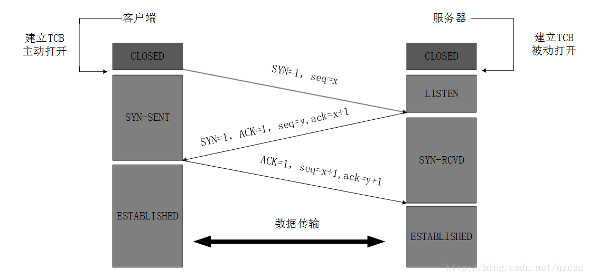
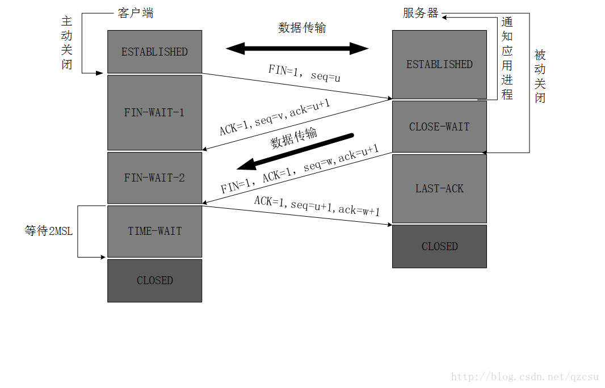

# TCP协议的三次握手和四次挥手
----
## TCP的概述
```
TCP把连接作为最基本的对象，每一条TCP连接都有两个端点，这种断点我们叫作套接字（socket），它的定义为端口号拼接到IP地址即构成了套接
字，例如，若IP地址为192.3.4.16 而端口号为80，那么得到的套接字为192.3.4.16:80。
```

## TCP报文首部

1. 源端口和目的端口，各占2个字节，分别写入源端口和目的端口；
2. 序号，占4个字节，TCP连接中传送的字节流中的每个字节都按顺序编号。例如，一段报文的序号字段值是 301 ，而携带的数据共有100字段，显然下一个报文段（如果还有的话）的数据序号应该从401开始；
3. 确认号，占4个字节，是期望收到对方下一个报文的第一个数据字节的序号。例如，B收到了A发送过来的报文，其序列号字段是501，而数据长度是200字节，这表明B正确的收到了A发送的到序号700为止的数据。因此，B期望收到A的下一个数据序号是701，于是B在发送给A的确认报文段中把确认号置为701；
4. 数据偏移，占4位，它指出TCP报文的数据距离TCP报文段的起始处有多远；
保留，占6位，保留今后使用，但目前应都位0；
5. 紧急URG，当URG=1，表明紧急指针字段有效。告诉系统此报文段中有紧急数据；
6. 确认ACK，仅当ACK=1时，确认号字段才有效。TCP规定，在连接建立后所有报文的传输都必须把ACK置1；
7. 推送PSH，当两个应用进程进行交互式通信时，有时在一端的应用进程希望在键入一个命令后立即就能收到对方的响应，这时候就将PSH=1；
8. 复位RST，当RST=1，表明TCP连接中出现严重差错，必须释放连接，然后再重新建立连接；
9. 同步SYN，在连接建立时用来同步序号。当SYN=1，ACK=0，表明是连接请求报文，若同意连接，则响应报文中应该使SYN=1，ACK=1；
10. 终止FIN，用来释放连接。当FIN=1，表明此报文的发送方的数据已经发送完毕，并且要求释放；
11. 窗口，占2字节，指的是通知接收方，发送本报文你需要有多大的空间来接受；
12. 检验和，占2字节，校验首部和数据这两部分；
13. 紧急指针，占2字节，指出本报文段中的紧急数据的字节数；
14. 选项，长度可变，定义一些其他的可选的参数。

## TCP连接的建立(三次握手)
先附上TCP连接的图吧,然后拿图来分析:


1. 服务器先创建传输控制块TCB,然后服务器进入监听阶段
2. (<font color="#dd0000">第一次握手</font>)客户端创建传输控制块TCB,然后发送一个请求连接SYN(SYN=1是请求连接)以及自己的序号seq,假设seq是x,发送完毕后客户端进入SYN-SENT(同步已发送)阶段
3. (<font color="#dd0000">第二次握手</font>)当服务器收到客户端发送的一个连接请求后,服务器发送一个确认收到的ACK(ACK=1表示自己已经收到)已经一个确认号(期望下一次收到的序号)ack=x+1,一个请求连接SYN已经自己的一个序号seq=y
4. (<font color="#dd0000">第三次握手</font>)当客户端收到服务的确认之后,给服务器发送一个确认ACK,一个确认号ack=y+1以及自己的一个序号seq=x+1
5. 客户端与服务器的连接建立成功,开始数据传输

```
为什么TCP的连接需要建立三次握手么?不能建立两次握手呢?

假设TCP连接只是建立两次握手的话,那么当第二次握手的时候服务器给客户端传输报文的途中突然链路堵塞了,这时候客户端没有收到服务器的一个确
认数据报,我们都知道TCP有一个超时重传机制,客户端会再次请求服务器发送确认数据报,当客户端收到以后会跟服务器建立连接,但是之后链路又可以
通行了,客户端突然收到服务器传来的一个确认数据报,这时候他会再次建立连接,这时候就会浪费资源.

而我们说的三次握手则不会产生这种现象,仔细分析一下,如果服务器在给客户端传输确认数据报的时候链路堵塞了,重传,客户端收到后会给服务器发
送一个ACK和一个确认号ack=y+1已经自己的一个seq=x+1,如果这时候收到链路堵塞时服务器传给客户端的数据报,由于确认号与预期的不一样,预期
ack=x+2,堵塞ack=x+1,所以客户端不会理会这一段确认数据报,直接丢弃.这样就不会出现连接出现两次而出现资源浪费的情况.
```
 附上一个动图(有助于理解)

_________________
## TCP连接的释放(四次挥手)
老规矩先附上TCP连接释放的图,然后拿图来分析:

1. (<font color="#dd0000">第一次挥手</font>)由客户端先发送一个FIN(FIN=1请求释放连接),以及自己的一个序号seq=u(这时候客户端已经不能向服务器端发送其他数据了)
2. (<font color="#dd0000">第二次挥手</font>)当服务器收到客户端的一个关闭请求之后,会发送一个确认ACK,以及一个确认号ack=u+1和自己的序号seq=v
当服务器给客户端发送完确认ACK后,服务器还是能向客户端传输数据的,客户端虽然不能发送数据但是还是能接受数据的
3. (<font color="#dd0000">第三次挥手</font>)当服务器把剩余的数据发送完之后,就向服务器端发送一个FIN,以及自己的一个seq=w(假设刚刚服务器端又向客户端传送了一些数据),以及一个确认号ack=u+1
4. (<font color="#dd0000">第四次挥手</font>)当客户端收到服务器端发送后客户端会发送一个确认ACK,ack=w+1以及自己的一个序号u+1，客户端需要等待2MSL然后再关闭
当服务器收到客户端的一个确认ACK后,服务器会立马关闭,
 附上动图,更好理解:


```
为什么第四次挥手,服务器收到客户端的确认ACK,服务器会立马关闭而客户端为什么不是发送之后直接断开连接而会等待2MSL才关闭呢?

假设客户端在发送ACK后直接关闭,如果确认号在中途丢失,服务器没有接受到,根据TCP的确认重传机制,服务器会再次发送一个释放连接的FIN,而这时
候客户端已经关闭了,那么服务器端就关闭不了了

若客户端在2MSL后关闭则不会出现这个问题,如果客户端的确认数据报在途中丢失,在2MSL内服务器会再次向客户端发送一个释放连接的FIN,客户端在
收到收到这个数据报后又会重启计时器,就解决了这个问题
```
