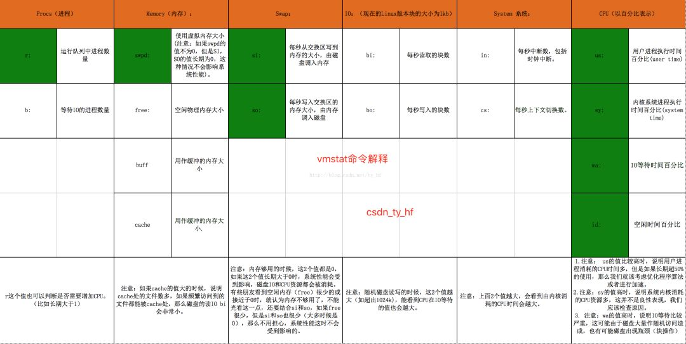

# vmstat使用说明

vmstat主要用于监控系统内存使用情况的工具，但是也包含一些CPU相关信息。
使用方法vmstat 5 5表示运行5次，每次5秒。结果如下：
```
[root@localhost server-mariadb-5.5.64]# vmstat 5 5
procs -----------memory---------- ---swap-- -----io---- -system-- ------cpu-----
 r  b   swpd   free   buff  cache   si   so    bi    bo   in   cs us sy id wa st
 0  0 123092 552576      0 1154156    0    0     4     3    2    0  0  0 100  0  0
 0  0 123092 552568      0 1154188    0    0     0     0  230  211  0  0 100  0  0
 0  0 123092 552692      0 1154188    0    0     0     0  233  213  0  0 100  0  0
 0  0 123092 552692      0 1154188    0    0     0     0  234  213  0  0 100  0  0
 0  0 123092 552692      0 1154188    0    0     0     0  231  211  0  0 100  0  0

```

